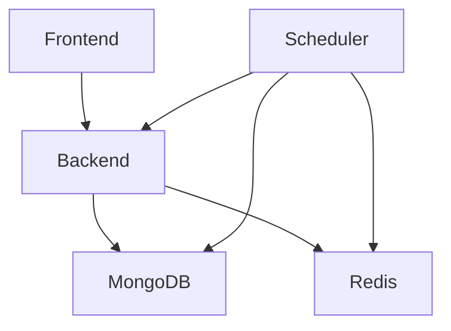

# Task Management System - Deployment Guide

## 🚀 Quick Start Deployment

### Prerequisites
- Docker 20.10+
- Docker Compose 2.0+
- 4GB RAM minimum
- 10GB disk space

### One-Command Deployment
```bash
git clone <repository-url>
cd task-management-system
docker-compose up --build
```

**Services will be available at:**
- Frontend: http://localhost:3000
- Backend API: http://localhost:5500
- MongoDB: localhost:27017
- Redis: localhost:6379

---

## 🔧 Development Setup

### 1. Environment Configuration

Create environment files from examples:

```bash
# Backend environment
cp backend/.env.example backend/.env

# Scheduler environment  
cp scheduler/.env.example scheduler/.env

# Frontend environment (already configured)
# frontend/.env contains VITE_API_URL=http://localhost:5500/api
```

### 2. Start Services

```bash
# Start all services with hot reloading
docker-compose up --build

# Start in background
docker-compose up -d --build

# View logs
docker-compose logs -f

# View specific service logs
docker-compose logs -f frontend
docker-compose logs -f backend
docker-compose logs -f scheduler
```

### 3. Initialize Demo Data

```bash
# Seed database with demo users and tasks
docker-compose exec backend npm run seed
```

### 4. Verify Deployment

```bash
# Check service health
curl http://localhost:5500/api/health

# Check frontend
curl http://localhost:3000

# Check all services are running
docker-compose ps
```

---

## 🐳 Docker Configuration Details

### Service Dependencies



### Health Checks

All services include health checks for proper startup ordering:

- **MongoDB**: `mongosh --eval "db.adminCommand('ping')"`
- **Redis**: `redis-cli ping`
- **Backend**: `wget http://localhost:5500/api/health`
- **Frontend**: Depends on backend health
- **Scheduler**: Depends on MongoDB and Redis health

### Volume Mounts

```yaml
volumes:
  # Database persistence
  mongodb_data:/data/db
  redis_data:/data
  
  # Development hot reloading
  ./frontend:/app (frontend code)
  ./backend:/app (backend code)
  ./scheduler:/app (scheduler code)
  ./shared:/app/shared (shared schemas)
```

---

## 🔄 Local Development (Without Docker)

### Prerequisites
- Node.js 20+
- MongoDB 7+
- Redis 7+

### 1. Install Dependencies

```bash
# Root dependencies
npm install

# Service dependencies
cd frontend && npm install
cd ../backend && npm install
cd ../scheduler && npm install
cd ../shared && npm install
```

### 2. Start Database Services

```bash
# Start MongoDB (macOS with Homebrew)
brew services start mongodb-community

# Start Redis (macOS with Homebrew)
brew services start redis

# Or use Docker for databases only
docker run -d -p 27017:27017 --name mongo mongo:7
docker run -d -p 6379:6379 --name redis redis:7-alpine
```

### 3. Configure Environment

```bash
# Backend .env
NODE_ENV=development
PORT=5500
MONGODB_URI=mongodb://localhost:27017/taskmanagement
REDIS_URL=redis://localhost:6379
JWT_SECRET=demo-jwt-secret-key-for-local-development

# Scheduler .env
NODE_ENV=development
MONGODB_URI=mongodb://localhost:27017/taskmanagement
REDIS_URL=redis://localhost:6379

# Frontend .env
VITE_API_URL=http://localhost:5500/api
```

### 4. Start Services

```bash
# Terminal 1 - Backend
cd backend
npm run dev

# Terminal 2 - Frontend
cd frontend
npm run dev

# Terminal 3 - Scheduler
cd scheduler
npm run dev
```

### 5. Seed Data

```bash
cd backend
npm run seed
```

---

## 🧪 Testing Deployment

### Automated Tests

```bash
# Run all tests
docker-compose exec backend npm test
docker-compose exec frontend npm test
docker-compose exec scheduler npm test

# Run specific test suites
docker-compose exec backend npm run test:auth
docker-compose exec backend npm run test:tasks
docker-compose exec backend npm run test:notifications
```

### Manual Testing Checklist

#### ✅ Authentication
- [ ] User registration works
- [ ] User login works
- [ ] JWT token authentication works
- [ ] Profile updates work

#### ✅ Task Management
- [ ] Create task works
- [ ] Update task works
- [ ] Delete task works
- [ ] Task assignment works
- [ ] Status changes work

#### ✅ Categories
- [ ] Create category works
- [ ] Update category works
- [ ] Delete category works (with validation)

#### ✅ Recurring Tasks
- [ ] Create recurring task works
- [ ] Pattern generation works
- [ ] Edit options work (this/future/all)

#### ✅ Notifications
- [ ] Task assignment notifications work
- [ ] Notification tray works
- [ ] Mark as read works
- [ ] Delete notifications work

#### ✅ Search & Filter
- [ ] Text search works
- [ ] Status filter works
- [ ] Category filter works
- [ ] Combined filters work

#### ✅ Responsive Design
- [ ] Mobile layout works
- [ ] Tablet layout works
- [ ] Desktop layout works

---

## 🔍 Monitoring and Debugging

### Service Logs

```bash
# View all logs
docker-compose logs

# Follow logs in real-time
docker-compose logs -f

# Service-specific logs
docker-compose logs backend
docker-compose logs frontend
docker-compose logs scheduler
docker-compose logs mongodb
docker-compose logs redis
```

### Health Check Endpoints

```bash
# Backend health
curl http://localhost:5500/api/health

# Backend API status
curl http://localhost:5500/api

# Frontend (should return HTML)
curl http://localhost:3000
```

### Database Access

```bash
# MongoDB shell
docker-compose exec mongodb mongosh taskmanagement

# Redis CLI
docker-compose exec redis redis-cli

# View collections
docker-compose exec mongodb mongosh taskmanagement --eval "show collections"

# View users
docker-compose exec mongodb mongosh taskmanagement --eval "db.users.find().pretty()"
```

### Performance Monitoring

```bash
# Container resource usage
docker stats

# Service-specific stats
docker stats task-management-system_backend_1
```

---

## 🚨 Troubleshooting

### Common Issues

#### Services Won't Start

```bash
# Check port conflicts
lsof -i :3000  # Frontend
lsof -i :5500  # Backend
lsof -i :27017 # MongoDB
lsof -i :6379  # Redis

# Clean restart
docker-compose down -v
docker-compose up --build
```

#### Database Connection Issues

```bash
# Check MongoDB is running
docker-compose exec mongodb mongosh --eval "db.adminCommand('ping')"

# Check Redis is running
docker-compose exec redis redis-cli ping

# Reset database
docker-compose down -v
docker volume rm task-management-system_mongodb_data
docker-compose up --build
```

#### Frontend Can't Connect to Backend

```bash
# Check backend is responding
curl http://localhost:5500/api/health

# Check frontend environment
cat frontend/.env

# Verify network connectivity
docker-compose exec frontend ping backend
```

#### Scheduler Not Processing Tasks

```bash
# Check scheduler logs
docker-compose logs scheduler

# Check scheduler can connect to database
docker-compose exec scheduler node -e "
import mongoose from 'mongoose';
mongoose.connect('mongodb://mongodb:27017/taskmanagement')
  .then(() => console.log('Connected'))
  .catch(err => console.error('Error:', err));
"
```

#### Permission Issues (macOS/Linux)

```bash
# Fix file permissions
sudo chown -R $USER:$USER .

# Fix Docker socket permissions
sudo chmod 666 /var/run/docker.sock
```

### Performance Issues

#### Slow Startup

```bash
# Use Docker BuildKit for faster builds
export DOCKER_BUILDKIT=1
docker-compose build --parallel

# Prune unused images
docker system prune -a
```

#### High Memory Usage

```bash
# Limit container memory
# Add to docker-compose.yml:
services:
  backend:
    mem_limit: 512m
  frontend:
    mem_limit: 256m
```

---

## 🔒 Security Considerations

### Development Security

- JWT secret is for demo purposes only
- No HTTPS in development setup
- CORS is open for localhost
- Rate limiting is minimal

### Production Recommendations

```bash
# Use strong JWT secret
JWT_SECRET=$(openssl rand -base64 32)

# Enable HTTPS
# Configure reverse proxy (nginx/traefik)

# Restrict CORS
CORS_ORIGIN=https://yourdomain.com

# Strengthen rate limiting
AUTH_RATE_LIMIT=3
API_RATE_LIMIT=50
```

---

## 📊 Production Deployment Considerations

### Environment Variables

```bash
# Production backend .env
NODE_ENV=production
PORT=5500
MONGODB_URI=mongodb://mongo-cluster:27017/taskmanagement
REDIS_URL=redis://redis-cluster:6379
JWT_SECRET=<strong-random-secret>
CORS_ORIGIN=https://yourdomain.com

# Production frontend .env
VITE_API_URL=https://api.yourdomain.com
```

### Docker Production Build

```dockerfile
# Multi-stage build for frontend
FROM node:20-alpine AS builder
WORKDIR /app
COPY package*.json ./
RUN npm ci --only=production
COPY . .
RUN npm run build

FROM nginx:alpine
COPY --from=builder /app/dist /usr/share/nginx/html
COPY nginx.conf /etc/nginx/nginx.conf
```

### Scaling Considerations

- Use external MongoDB cluster
- Use Redis cluster for session storage
- Load balance multiple backend instances
- Use CDN for frontend assets
- Implement proper logging and monitoring

### Backup Strategy

```bash
# MongoDB backup
docker-compose exec mongodb mongodump --db taskmanagement --out /backup

# Redis backup
docker-compose exec redis redis-cli BGSAVE
```

---

## 📋 Deployment Checklist

### Pre-Deployment
- [ ] All tests pass
- [ ] Environment variables configured
- [ ] Database migrations ready (if any)
- [ ] Backup strategy in place

### Deployment
- [ ] Services start successfully
- [ ] Health checks pass
- [ ] Database seeded (if needed)
- [ ] All endpoints responding

### Post-Deployment
- [ ] Manual testing completed
- [ ] Performance acceptable
- [ ] Logs are clean
- [ ] Monitoring configured

### Rollback Plan
- [ ] Previous version tagged
- [ ] Database backup available
- [ ] Rollback procedure documented
- [ ] Team notified of deployment